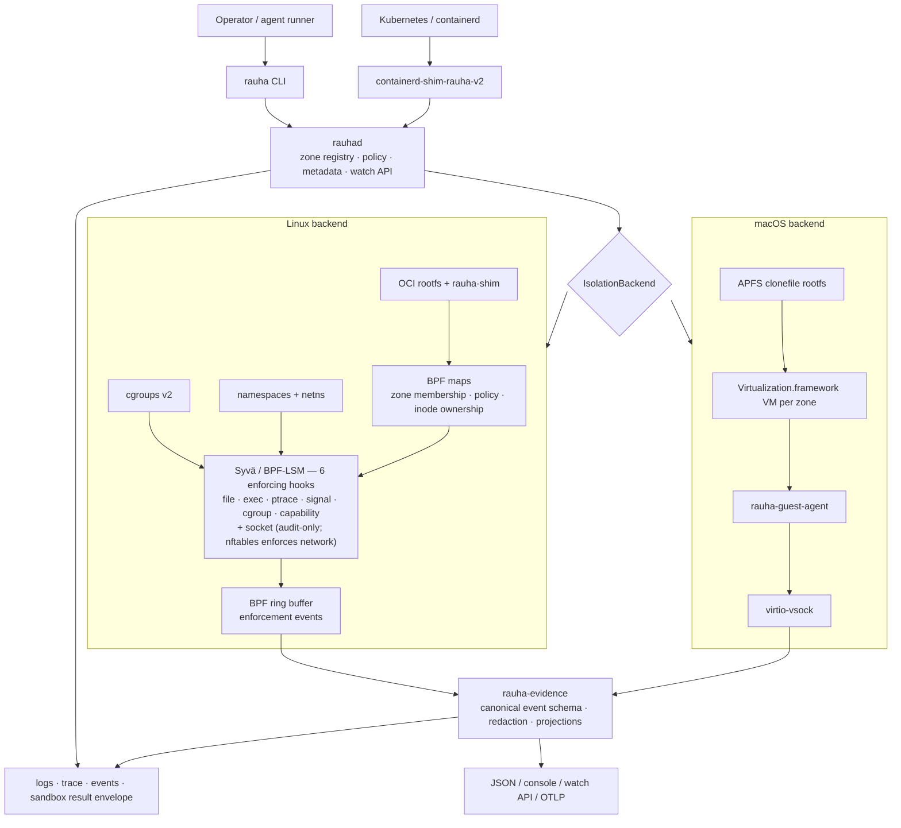

# Rauha

**Your agents run code you didn't write. Rauha runs it inside a zone you can bound, observe, audit, and enforce.**

[](#license)
[](Cargo.toml)
[](#requirements)
[-8a2be2.svg)](#rauha-and-syvä)

Rauha is an agent sandbox runtime built on controlled execution **zones**. A
zone is the task boundary: it ties together filesystem view, processes,
networking, resources, policy, logs, audit events, and optional kernel
enforcement into one unit. You give an agent a task; Rauha runs it in a zone and
hands back a structured result — stdout, stderr, exit code, and the events the
task produced.

No bespoke per-agent sandbox. No "run it on the CI box and hope." Run `rauhad`,
point the CLI at it, give each task a zone.

> *Rauha* (Finnish) — *peace*. What you get when untrusted execution stays inside its boundary.

On Linux, the zone is built from cgroups, namespaces, networking, and rootfs
handling; **Syvä** makes the kernel enforce the boundary with BPF-LSM. On macOS,
the zone *is* a lightweight VM. Same model, two backends.

---

## Contents

- [Why Rauha is different](#why-rauha-is-different)
- [Quickstart](#quickstart)
- [Agent sandboxing](#agent-sandboxing)
- [Architecture](#architecture)
- [Features](#features)
- [Requirements](#requirements)
- [Control surface](#control-surface)
- [How zones work](#how-zones-work)
- [Rauha and Syvä](#rauha-and-syvä)
- [Limitations (honest)](#limitations-honest)
- [Build, test, and verify](#build-test-and-verify)
- [Roadmap](#roadmap)
- [License](#license)

## Why Rauha is different

- **The task is the unit, not the container.** A zone wraps one agent task —
  filesystem, processes, network, policy, and audit — and returns a single
  structured result. You reason about *what the task did*, not about a pile of
  container IDs.
- **One boundary, honestly two backends.** Linux uses cgroups + namespaces +
  networking with optional in-kernel enforcement; macOS gives each zone its own
  VM. The daemon is platform-agnostic behind one `IsolationBackend` trait — it
  never knows which OS it is on.
- **Observability is part of the boundary.** Every zone exposes logs, audit
  events, and (on Linux) kernel enforcement events through one watch API.
  Isolation you cannot observe is isolation you cannot trust.
- **Enforcement belongs to Syvä.** Rauha creates and runs the zones; the Linux
  kernel-level deny decisions live behind the Syvä enforcement boundary. Rauha
  does not pretend the sandbox is a hardware boundary.

## Quickstart

Run the daemon (development listens on `[::1]:9876`):

```sh
RUST_LOG=rauhad=debug cargo run --bin rauhad
```

Create a policy-bound zone, pull an image, and run a container in it:

```sh
rauha zone create --name frontend --policy policies/standard.toml
rauha image pull alpine:latest
rauha run --zone frontend alpine:latest /bin/echo hello
rauha ps --zone frontend
```

Watch the zone explain itself — logs, live events, and per-zone resource use:

```sh
rauha logs <container-id>          # stream container stdout/stderr
rauha events                       # live zone + enforcement events
rauha top                          # per-zone resource usage
```

On macOS, install VM assets and re-sign the daemon first (see
[Requirements](#requirements)); `rauha setup` provisions the kernel and
initramfs. Add `--json` to any non-streaming command for machine-readable
output.

## Agent sandboxing

The task-level shape Rauha is built around:

```sh
rauha sandbox --image python:3.12 --repo-path . -- pytest tests/
```

returning one structured result:

```json
{
  "task_id": "task_123",
  "zone_id": "zone_456",
  "command": ["pytest", "tests/"],
  "status": "succeeded",
  "exit_code": 0,
  "duration_ms": 1842,
  "stdout": "...",
  "stderr": "",
  "admission": "strict",
  "unavailable_controls": [],
  "events": [],
  "enforcement_events": []
}
```

**Status — runtime implemented.** The `rauha sandbox` CLI command, the
`rauha.sandbox.v1.SandboxService` gRPC service (`proto/sandbox.proto`), and the
result types in `rauha-common` are wired end to end through the daemon and CLI.
The daemon allocates a task zone when needed, starts the container, waits,
captures stdout/stderr/exit code, collects lifecycle and best-effort enforcement
events, and cleans up temporary resources unless `--keep-zone` is set.
Strict admission is the default and refuses execution when a requested control
is unavailable. `--audit` explicitly permits a temporary task zone to run
degraded; the effective admission and failed controls remain in the result.

## Architecture

Policy and tasks come in through the CLI or containerd; the daemon delegates all
zone/container work to the active platform backend; logs, audit, and enforcement
events flow back out through one watch API.



| Crate | Role |
| --- | --- |
| `rauhad` | Daemon — gRPC server, zone registry, metadata (redb), networking, Linux/macOS backends |
| `rauha-cli` (`rauha`) | Operator CLI over the daemon's gRPC API |
| `rauha-common` | Shared types, the `IsolationBackend` trait, policy parsing, sandbox result types, shim IPC protocol |
| `rauha-enforcer-api` | Enforcement backend trait, kernel-facing policy/event types, capabilities, `NoopEnforcer`, and shared conformance harness |
| `rauha-shim` | Per-*zone* sync process (Linux) — forks and runs container processes |
| `rauha-guest-agent` | Guest-side daemon inside macOS VMs — container lifecycle over virtio-vsock |
| `rauha-oci` | OCI image pull, content store, rootfs preparation, runtime spec generation |
| `rauha-evidence` | Evidence-grade observability schema, projections, and sinks (does not enforce) |
| `containerd-shim-rauha-v2` | containerd shim v2 — bridges containerd's Task API to `rauhad` for Kubernetes |
| `rauha-enforce` | Legacy in-repo enforcement seed — superseded by Syvä; do not extend |
| `rauha-ebpf` / `rauha-ebpf-common` | In-repo Linux eBPF LSM programs and shared `repr(C)` types (separate build) |
| `xtask` | Build helper for eBPF and guest-agent artifacts |

**One shim per zone, not per container.** Zones are the isolation boundary, so
`rauhad` spawns one `rauha-shim` per zone; the shim forks additional container
processes on request. This diverges deliberately from containerd's
one-shim-per-container model.

## Features

- **Zone-scoped execution** — filesystem view, processes, network, resources,
  policy, and audit bound to one task or workload.
- **Structured task results** — stdout / stderr / exit code / duration /
  enforcement events captured into one contract (`SandboxService`, runtime
  landing).
- **Two isolation backends** — Linux (cgroups v2, namespaces, veth/bridge +
  nftables NAT, rootfs via the per-zone shim) and macOS (one
  Virtualization.framework VM per zone, virtio-fs + APFS `clonefile`, pf
  anchors).
- **Zone networking** — each zone gets a unique IP from `10.89.0.0/16` via the
  `rauha0` bridge with nftables NAT masquerade; per-zone forward chains default
  to drop.
- **Observability built in** — `rauha logs`, `rauha events`, `rauha trace`, and
  `rauha top`; on Linux, kernel deny events stream from a BPF ring buffer through
  the `WatchEvents` gRPC API and `rauha-evidence` normalizes them.
- **TOML policy** — zone type, filesystem rules, network mode and egress,
  resource limits, capabilities, and allowed cross-zone communication
  (`policies/standard.toml`).
- **Kubernetes deployment path** — `containerd-shim-rauha-v2` maps a pod sandbox
  to a Rauha zone via `runtimeClassName: rauha`.

## Requirements

Rauha runs on Linux and macOS; full kernel enforcement is Linux-only.

- **Linux (eBPF enforcement)** — Linux 6.1+ with `CONFIG_BPF_LSM=y`,
  `CONFIG_BPF_SYSCALL=y`, `CONFIG_DEBUG_INFO_BTF=y`; boot parameter
  `lsm=lockdown,capability,bpf`; BTF at `/sys/kernel/btf/vmlinux`. The Linux
  daemon **fails closed**: it requires root and a working BPF-LSM kernel, and
  refuses to start without kernel enforcement. There is no degraded Linux mode:
  running zones without Syvä/BPF-LSM enforcement would weaken the isolation
  contract. For rootless local iteration, use the macOS backend.
- **macOS (Virtualization.framework)** — macOS 15+ on Apple Silicon or Intel
  with VT-x. `rauhad` must be signed after every build:
  `codesign --entitlements rauhad/rauhad.entitlements -s - target/debug/rauhad`.
  VM assets (vmlinux + initramfs) install to `/var/lib/rauha/vm/` via
  `rauha setup`.

Root directory: `/var/lib/rauha` on Linux, `/tmp/rauha` on macOS (override with
`RAUHA_ROOT`).

## Control surface

The CLI is a thin client of the daemon's gRPC API (`RAUHA_ADDR`, default
`http://[::1]:9876`).

```sh
rauha zone create --name frontend --policy policies/standard.toml
rauha zone list
rauha image pull alpine:latest
rauha run --zone frontend alpine:latest /bin/echo hello
rauha ps --zone frontend
rauha exec <container-id> -- /bin/sh    # exec in a running container
rauha attach <container-id>             # attach to a running container
rauha logs <container-id>               # stream stdout/stderr
rauha events                            # live zone + enforcement events
rauha trace --zone frontend             # per-zone syscall trace
rauha top                               # per-zone resource usage
rauha policy show --zone frontend
rauha stop <container-id> && rauha delete <container-id>
rauha zone delete --name frontend --force
rauha sandbox --image python:3.12 -- pytest   # task-level (runtime landing)
```

`trace`, `top`, `events`, `logs`, `exec`, `attach`, and `setup` are streaming or
interactive and do not take `--json`.

## How zones work

A zone is not just a namespace and not just a cgroup. It is Rauha's unit of
execution, policy, isolation, observability, and enforcement, tying together:
cgroups, namespaces, rootfs/filesystem view, network namespace + bridge + rules,
runtime metadata, policy, the audit stream, and optional kernel enforcement.

User-visible zone IDs are UUIDs (persisted in redb, the source of truth on crash
recovery); kernel-side they compact to `u32` BPF map keys. On startup `rauhad`
reconciles from redb — re-establishing cgroups, networking, and (on Linux) BPF
map state — then cleans up orphaned kernel state. On macOS the zone boundary is
the VM itself, so no cgroups or namespaces are needed.

## Rauha and Syvä

**Rauha creates the zones. Syvä makes the Linux kernel respect them.**

| Rauha owns | Syvä owns |
| --- | --- |
| Runtime lifecycle, zone create/delete | Linux kernel enforcement (BPF-LSM) |
| Sandbox/container execution | eBPF programs, BPF maps, ring-buffer events |
| Policy loading and validation | file / exec / ptrace / signal / cgroup / capability deny decisions (socket is audit-only; nftables enforces network) |
| Image, rootfs, networking, metadata | per-hook counters and privileged self-tests |
| Logs, audit, user-facing event surfaces | the in-kernel deny-before-it-happens decision |
| Kubernetes / containerd integration | |

Syvä is a separate product ([`github.com/false-systems/syva`](https://github.com/false-systems/syva)).
The `rauha-enforcer-api` crate defines this boundary as a backend-neutral trait,
with a `NoopEnforcer` and a shared conformance harness every backend must pass.
Be precise about today's state: the in-repo Linux eBPF backend is the
implementation the daemon actually runs, an external Syvä backend is not yet
wired in, and routing the daemon's live enforcement entirely through the trait
is still in progress. **The seam is real, but not yet the sole enforcement
path.** The `rauha-enforce` crate is a legacy seed and is not extended. See
[`docs/rauha-syva-boundary.md`](docs/rauha-syva-boundary.md).

## Limitations (honest)

- **Sandbox event capture is best-effort** — Linux enforcement events come from
  a daemon-wide broadcast and can be absent on unsupported backends or partial
  under broadcast lag; they are not an audit-complete log.
- **A sandbox, not a hardware boundary** — BPF-LSM is OS-level isolation and is
  additive-only: it can deny, but cannot override SELinux/AppArmor MAC denials.
  Covert channels through shared kernel resources are out of scope.
- **The two backends are different isolation models** — Linux cgroups/namespaces
  vs. a per-zone VM on macOS; they are not byte-for-byte equivalent.
- **Linux enforcement needs kernel support** — BPF-LSM, BTF, `pahole`, and
  compatible struct offsets. `cargo xtask build-ebpf` generates offsets for the
  target kernel and writes a sidecar manifest bound to the eBPF object hash; the
  daemon validates that manifest at startup and **refuses to start** rather than
  run with no enforcement or with wrong offsets.
- **Kubernetes integration requires containerd + RuntimeClass wiring**;
  installation docs and examples are still being written.

## Build, test, and verify

```sh
cargo build                          # all workspace crates
cargo test                           # all unit tests
cargo build -p containerd-shim-rauha-v2
cargo xtask build-ebpf --release     # eBPF object + offsets sidecar for this kernel
```

The shared enforcer conformance suite runs against `NoopEnforcer` in ordinary
tests. The real Linux eBPF backend test is opt-in because it loads programs and
touches global pinned BPF state under `/sys/fs/bpf/rauha`:

```sh
RAUHA_RUN_EBPF_CONFORMANCE=1 \
  cargo test -p rauhad linux_enforcer_passes_basic_conformance -- --nocapture
```

Run that only as root on an isolated Linux host with the required BPF-LSM
kernel. If `/sys/fs/bpf/rauha` already contains pins from a daemon or prior run,
the test skips unless `RAUHA_EBPF_CONFORMANCE_OVERWRITE_PINS=1` is also set.

Run the daemon and drive it with the CLI:

```sh
RUST_LOG=rauhad=debug cargo run --bin rauhad
cargo run --bin rauha -- zone create --name test
cargo run --bin rauha -- run --zone test alpine:latest /bin/echo hello
```

The **oracle** is a ground-truth gRPC suite (55 numbered cases) that validates
`rauhad` through its public API only — it never reads source or mocks. It needs a
running daemon:

```sh
cd eval/oracle
RAUHA_GRPC_ENDPOINT=http://[::1]:9876 cargo test            # all cases
RAUHA_GRPC_ENDPOINT=http://[::1]:9876 cargo test -- case_001 # one case
```

Linux integration tests under `tests/integration/` require root and a running
daemon (eBPF gates need a BPF-LSM kernel):

```sh
bash tests/integration/test-zone-isolation.sh
bash tests/integration/test-zone-networking.sh
bash tests/integration/test-cgroup-lock.sh     # eBPF enforcement required
```

## Roadmap

- Keep the in-repo Linux eBPF/maps/events path behind `rauha-enforcer-api` while
  the external Syvä backend is integrated.
- Add external Syvä integration as another `rauha-enforcer-api` backend and
  prove parity with the shared conformance harness.
- A privileged Syvä/Rauha kernel-enforcement test suite.
- Kubernetes installation docs and `RuntimeClass` examples; deeper workload
  discovery for existing clusters.
- Richer agent orchestration / SDK surfaces.

## License

Licensed under the [Apache License, Version 2.0](LICENSE). Unless you explicitly
state otherwise, any contribution intentionally submitted for inclusion in this
work as defined in the Apache-2.0 license shall be licensed as above, without any
additional terms or conditions.
