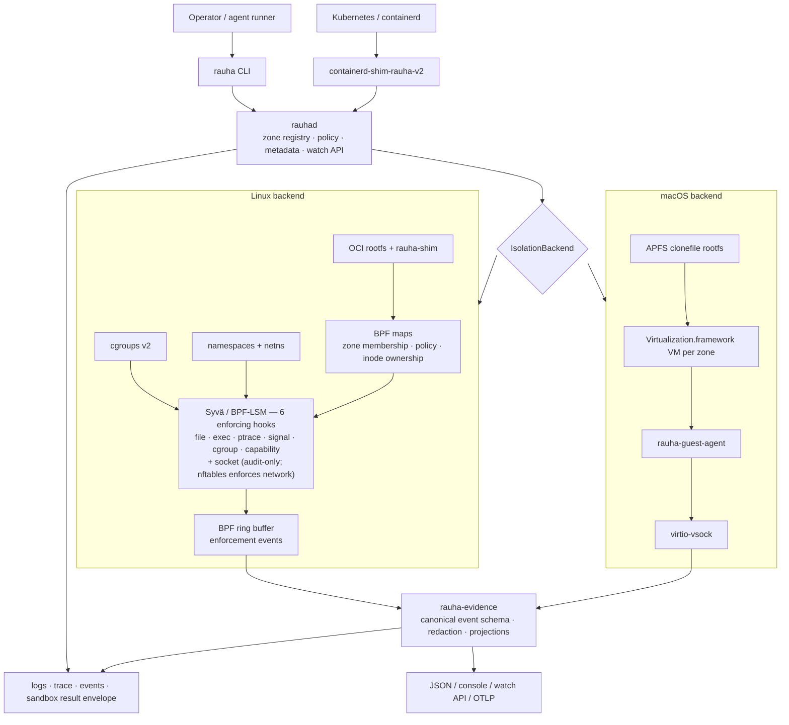

# Architecture

Policy and tasks come in through the CLI or containerd; the daemon delegates all
zone/container work to the active platform backend; logs, audit, and enforcement
events flow back out through one watch API.



## Crates

| Crate | Role |
| --- | --- |
| `rauhad` | Daemon — gRPC server, zone registry, metadata (redb), networking, Linux/macOS backends |
| `rauha-cli` (`rauha`) | Operator CLI over the daemon's gRPC API |
| `rauha-common` | Shared types, the `IsolationBackend` trait, policy parsing, sandbox result types, shim IPC protocol |
| `rauha-enforcer-api` | Enforcement backend trait, kernel-facing policy/event types, capabilities, `NoopEnforcer`, and shared conformance harness |
| `rauha-shim` | Per-*zone* sync process (Linux) — forks and runs container processes |
| `rauha-guest-agent` | Guest-side daemon inside macOS VMs — container lifecycle over virtio-vsock |
| `rauha-oci` | OCI image pull, content store, rootfs preparation, runtime spec generation |
| `rauha-evidence` | Evidence-grade observability schema, projections, and sinks (does not enforce) |
| `containerd-shim-rauha-v2` | containerd shim v2 — bridges containerd's Task API to `rauhad` for Kubernetes |
| `rauha-enforce` | Legacy in-repo enforcement seed — superseded by Syvä; do not extend |
| `rauha-ebpf` / `rauha-ebpf-common` | In-repo Linux eBPF LSM programs and shared `repr(C)` types (separate build) |
| `xtask` | Build helper for eBPF and guest-agent artifacts |

## One shim per zone, not per container

Zones are the isolation boundary, so `rauhad` spawns one `rauha-shim` per zone;
the shim forks additional container processes on request while keeping zone
lifecycle, logs, exec IPC, and evidence together. This diverges deliberately
from containerd's one-shim-per-container model.

## How zones work

A zone is not just a namespace and not just a cgroup. It is Rauha's unit of
execution, policy, isolation, observability, and enforcement, tying together:
cgroups, namespaces, rootfs/filesystem view, network namespace + bridge + rules,
runtime metadata, policy, the audit stream, and optional kernel enforcement.

User-visible zone IDs are UUIDs (persisted in redb, the source of truth on crash
recovery); kernel-side they compact to `u32` BPF map keys. On startup `rauhad`
reconciles from redb — re-establishing cgroups, networking, and (on Linux) BPF
map state — then cleans up orphaned kernel state. On macOS the zone boundary is
the VM itself, so no cgroups or namespaces are needed.

## Control surface

The CLI is a thin client of the daemon's gRPC API (`RAUHA_ADDR`, default
`http://[::1]:9876`).

```sh
rauha sandbox --image python:3.12 --repo-path . -- pytest   # task-level
rauha zone create --name frontend --policy policies/standard.toml
rauha zone list
rauha zone verify frontend --json       # boundary self-check
rauha image pull alpine:latest
rauha run --zone frontend alpine:latest /bin/echo hello
rauha ps --zone frontend
rauha exec <container-id> -- /bin/sh    # exec in a running container
rauha attach <container-id>             # attach to a running container
rauha logs <container-id>               # stream stdout/stderr
rauha events                            # live zone + enforcement events
rauha trace --zone frontend             # per-zone syscall trace (unimplemented)
rauha top                               # per-zone resource usage
rauha policy show --zone frontend
rauha stop <container-id> && rauha delete <container-id>
rauha zone delete --name frontend --force
```

`trace`, `top`, `events`, `logs`, `exec`, `attach`, and `setup` are streaming or
interactive and do not take `--json`; every other read command does.
