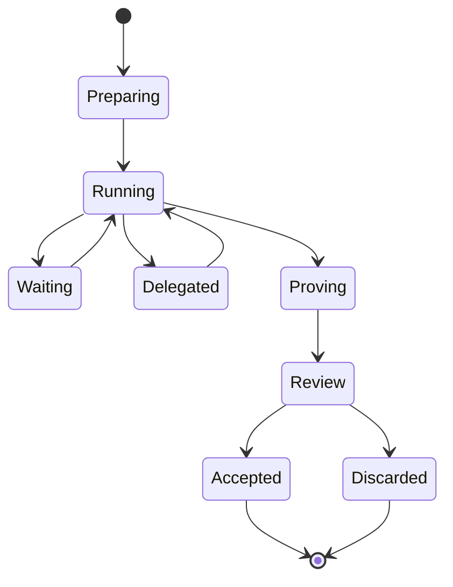
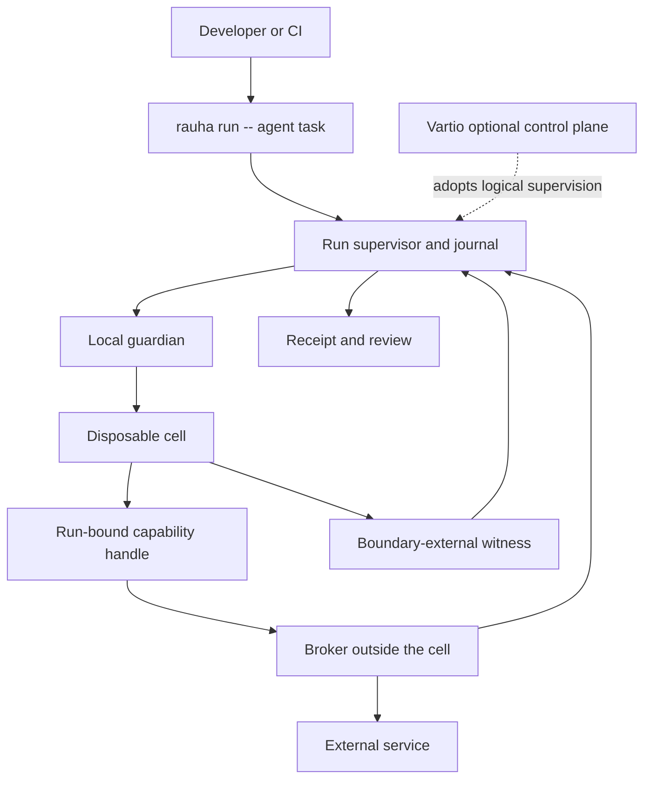

# Rauha: The Run for Agentic Work

_Canonical product thesis — adopted 2026-08-28. Product vocabulary and
positioning lines here take precedence over other docs; the wire-level Run
contract lives in [`run-protocol-v0.md`](run-protocol-v0.md), and the
market/kernel research behind the hardening roadmap in
[`positioning-and-roadmap.md`](positioning-and-roadmap.md)._

> **Docker made applications portable across computers. Rauha makes agentic work portable across agents, environments and stages.**

> **Any agent. Any environment. One Run.**

That is the architectural and company ambition. Launch support will be intentionally narrower.

The first product promise is:

> **Rauha gives a coding agent a ready-to-use computer for each task. It can work unattended; when it finishes, the developer reviews the code, effects, checks and behaviour and decides what leaves.**

Short version:

> **Run coding agents unattended. Keep control of what leaves.**

The category is an **agentic-work runtime**. The first wedge is coding agents working on real repositories.

Hardening is necessary, but it is not the whole product. A sandbox gives an agent somewhere to execute. Rauha gives its work a life: preparation, authority, supervision, recovery, review and acceptance.

> **Docker made the container the unit of software execution. Rauha makes the Run the unit of agentic work.**

## The problem: agents have brains, but no work layer

Coding agents can reason, edit files and invoke tools. Developers still construct almost everything around that intelligence:

- Prepare a reproducible environment.
- Maintain Dockerfiles, devcontainers and toolchain images.
- Decide which credentials and services the agent may reach.
- Babysit permissions and long-running sessions.
- Recover work after a process, laptop or runner fails.
- Separate proposed external effects from effects that already happened.
- Understand what the agent actually did, not only what it reported.
- Review the result and clean up the environment.

Security products address pieces of this problem. Container runtimes provide execution. Sandboxes provide boundaries. CI systems provide jobs. Agent vendors provide reasoning and tool use. None of those objects alone describes the complete life of one piece of agentic work.

Rauha's job is to make that life coherent.

## What the developer experiences

```bash
rauha run -- claude -p "upgrade Postgres and fix the migration"
```

Rauha:

1. Creates a disposable environment from the Git-tracked repository state.
2. Starts the supported project toolchain.
3. Runs the agent without recurring permission prompts; the environment is the boundary.
4. Gives the agent run-scoped capabilities for supported external operations rather than raw credentials.
5. Supervises the run and keeps its journal outside the execution environment.
6. Independently observes process, file and network activity with explicit capture quality.
7. Runs the project's checks.
8. Returns one reviewable result.

```text
RESULT              completed
CHANGES             9 files
AUTHORITY           github.issue.read
                     github.draft_pr.request
CAPABILITY USE      github.issue.read × 1
COMMITTED EFFECTS   none
PENDING EFFECTS     create draft PR from rauha/run-42
BEHAVIOUR           changed from accepted class
                    + attempted read /app/.env.production
                    + attempted connect db-prod.internal:5432
DENIED              read /app/.env.production
                     connect db-prod.internal:5432
CHECKS              37/37 passed
OBSERVATION         witness attached · capture quality sufficient
INJECTED CREDS      none

[apply changes] [approve requested effect] [inspect] [discard]
```

Every word must be supportable:

- **CHANGES** describes the workspace difference.
- **AUTHORITY** says what the run was permitted to request.
- **CAPABILITY USE** records confirmed read-only or otherwise non-mutating capability calls.
- **COMMITTED EFFECTS** lists externally confirmed mutating operations.
- **PENDING EFFECTS** have not happened and still require approval.
- **BEHAVIOUR** summarizes meaningful process, file and network differences against an explicitly accepted, comparable behavioural class. A first Run has no accepted class.
- **DENIED** lists observed attempts blocked by the boundary or a broker.
- **CHECKS** reports executed tests and gates. It is evidence, not proof of correctness.
- **OBSERVATION** describes the witness and its capture quality; it never implies perfect visibility.
- **INJECTED CREDS** lists credentials deliberately placed inside the environment. The target is `none`.

In the first release, external writes are staged until review. Discard destroys the disposable workspace but retains the receipt. It cannot reverse an effect already recorded as committed.

## The first Rauha magic: a behaviour diff beside the code diff

Git shows what changed in the repository. It cannot show every relevant thing the agent did while producing that change.

Rauha adds a second review object:

```text
CODE DIFF
  9 files changed

BEHAVIOUR DIFF
+ attempted read /app/.env.production
+ attempted connect db-prod.internal:5432
```

The behaviour diff does not depend on the agent's own narration or application instrumentation. A boundary-external witness observes process, file and network activity; Ruuma normalizes sufficiently observed executions and compares their causally meaningful structure.

This is the first visible magic, not the whole product. It occupies the `observe → compare` portion of the larger Run lifecycle.

Rauha supports two distinct postures:

| Posture | Meaning |
| --- | --- |
| **Discover** | Run the work, independently observe it, and report meaningful new behaviour afterward. Discovery detects an unsafe action but does not pretend to have prevented it. |
| **Protect** | Enforce declared boundaries during the Run. Forbidden direct access is denied, while supported external writes are requested through capabilities and staged for review. |

Observation history is not trust:

- The first Run is not automatically a baseline.
- Frequent behaviour is not automatically acceptable behaviour.
- A developer explicitly accepts a semantic behavioural class for comparable work, environment and authority.
- Later compatible Runs show meaningful differences; incompatible or insufficiently observed Runs refuse comparison.
- Model, prompt, tools, image and authority versions are recorded as provenance. A model change may correlate with a behaviour change, but Rauha does not claim causation without evidence.

The concise public explanation is:

> **Git shows what changed in the code. Rauha shows what changed in the work.**

## Who it is for

The first user is:

> **A senior developer or platform engineer already using Claude Code, Codex or another coding agent daily, whose agent needs repository and GitHub access and whose tasks are long enough to run unattended.**

The strongest first users:

- Run agents for tasks lasting more than a few minutes.
- Use real repositories with dangerous local credentials or production access nearby.
- Need GitHub, development services or infrastructure context.
- Currently babysit permission prompts or maintain Docker and devcontainer glue.
- Want the agent to work autonomously without exposing the laptop.
- Need a useful result rather than thousands of lines of session output.

The organizational buying trigger is:

> **Ten teams are building different agent sandboxes and passing credentials into them. We need one supported way to let agents work.**

- **User and champion:** senior developers, platform engineers and Developer Experience leads.
- **Economic buyer:** Head of Platform, Developer Productivity or Engineering Productivity.
- **Security:** approver and later co-buyer, not the initial product experience.

## The product model

The durable product object is the **Run**, not the container, VM or Cell.

| Word | Meaning |
| --- | --- |
| **Work** | The requested task and its declared inputs, authority and checks. |
| **Run** | One durable, supervised attempt at that work. It owns the journal, workspace lineage, grants and result. |
| **Cell** | A disposable execution environment used by a run. A resumed run may receive another cell. |
| **Zone** | The isolation primitive inside a cell: filesystem, processes, network, resources and policy. Internal terminology. |
| **Capability** | A Run-scoped handle to one permitted operation provided by a trusted service outside the Cell. |
| **Journal** | The append-only record of lifecycle, ownership, grants, effect intents, effect results, checkpoints and decisions. Internally implemented with WAL semantics. |
| **Behavioural class** | A deliberately accepted semantic class of sufficiently observed behaviour for comparable Runs. |
| **Receipt** | The durable account of changes, authority, effects, checks and observation quality. |
| **Computer** | The simple marketing metaphor for what the agent receives. |

A Run may wait, delegate, move to another machine, survive multiple Cells and be reconstructed from its journal. A Cell cannot.

> **Rauha manages the Run. The Cell is where it executes.**

## The Run lifecycle



The common path is:

```text
prepare → run → supervise → recover → review → accept
```

`waiting` and `delegated` are important product states. They exist because Rauha owns the work rather than merely launching a process. A Run can pause for an approval, a dependency, a child agent or an external result without keeping one container alive forever.

If the agent, Cell or machine fails, the supervisor reconstructs the Run from the journal and a known workspace checkpoint. Observers and proxies may restart automatically. The agent resumes only from a known checkpoint; Rauha never invents exactly-once execution for arbitrary code.

## Portable Runs, replaceable Cells

The Cell is a backend, not the public abstraction.

| Cell backend | Possible use |
| --- | --- |
| Local process with OS boundaries | Fast local development where the host supports sufficient enforcement |
| Docker or another OCI runtime | Existing development and CI environments |
| containerd | Kubernetes and lower-level runtime integration |
| QEMU, Firecracker or platform microVM | Strong disposable boundaries and live snapshot/fork capabilities |
| Kubernetes or cloud worker | Remote, elastic and team execution |

`Any environment` is the design goal, not a day-one compatibility claim. The first release supports a small tested matrix. Over time, a Run should move from laptop to CI to a remote worker without changing its identity, authority semantics or receipt format.

The long-term portability chain is:

```text
laptop Run
    → CI continuation
        → remote or delegated Run
            → deployment request
                → production operation
                    → connected receipts
```

The invariant is the Run Protocol: manifest, journal events, workspace lineage, grants, effect states, evidence references and Receipt. Cell implementations remain replaceable.

> **Containers are interchangeable machinery. The Run is the product.**

## Architecture



There are two supervision roles:

| Role | Responsibility |
| --- | --- |
| **Run supervisor** | Reduces the journal into lifecycle state and decides waiting, resumption, delegation and review. Rust locally or Elixir/OTP remotely. |
| **Local guardian** | Always remains beside the Cell, owns physical enforcement and capability channels, and freezes the Cell if the active supervisor lease disappears. |

Vartio adopts logical supervision. It never replaces the local process responsible for enforcing the boundary.

The supervisor role is always present. In local mode it is a small in-process or local Rust supervisor for one Run. Vartio replaces that implementation with durable, distributed OTP supervision that can survive sessions and machines.

> **Local Rauha gives the work a supervisor. Vartio makes that supervisor effectively immortal.**

Only one logical supervisor may authorize effects. Every adoption receives a monotonically increasing ownership epoch; capability brokers reject commands carrying an older epoch.

## Capabilities, not hidden tokens

A Rauha capability is not merely a credential-injecting HTTP proxy.

Not this:

```text
allow api.github.com
+ inject GitHub token
```

This:

```text
github.read_issue(repo, issue)
github.request_branch(repo, ref, patch)
github.request_draft_pr(repo, ref)
```

Each capability is:

- Bound to one Run and ownership epoch.
- Limited to an exact resource, operation and lifetime.
- Reached through a protected local channel rather than a transferable bearer secret.
- Implemented by a broker outside the Cell.
- Revocable when the Run pauses or ends.
- Journaled before and after every side effect.

When a service capability exists, direct access to that service is denied unless separately granted. Otherwise the agent could bypass the broker.

Every side-effecting call follows:

```text
intent durably recorded
        ↓
effect attempted
        ↓
committed | failed | unknown
```

> **No external effect without a durable intent.**

`unknown` is a valid outcome after a crash between the external effect and its receipt. Provider idempotency and reconciliation may resolve it; Rauha never silently assumes success or retries an unsafe operation.

Local capability integrations should be useful and freely available. The paid product is organization-managed issuance: shared providers, scoped grants, leases, revocation, policy and history.

## Journal and observation

> **The journal is the truth. The supervisor is the live view. The Cell is a materialization. The Receipt is the verdict.**

The journal is the durable truth about what Rauha itself controlled:

- Run lifecycle transitions.
- Supervisor ownership epochs.
- Capability grants.
- Write-ahead intents and results.
- Checkpoint and workspace lineage.
- Check execution and final decisions.

The journal does **not** claim complete knowledge of every process or syscall. A boundary-external witness observes runtime activity and carries its own coverage, loss, ordering and attribution quality.

```text
journal integrity ≠ observation completeness
```

This preserves the False Systems principle:

> **Uncertainty is data.**

The WAL is internal machinery, not the developer-facing product. Live OTP messages, process notifications and observer events may make the interface fast, but the journal head and active ownership epoch decide what is authoritative. A Cell may be destroyed and reconstructed; the Run and its journal remain.

The relevant lesson from [Cursor's Git at any scale](https://cursor.com/blog/git-at-any-scale) is architectural rather than product-facing: preserve one durable source of truth, treat faster distributed views as reconstructible, and publish state changes through an authoritative head. Rauha applies that lesson to work rather than files.

A fork receives a new Run identity, ownership epoch and newly minted grants. It references an immutable parent-journal prefix and workspace snapshot; it never inherits live handles, unresolved intents or assumed external state.

## Why existing tools are not yet the complete answer

The convenience, isolation and runtime-monitoring layers are crowded. Rauha cannot claim that nobody else can sandbox an agent, proxy its credentials or observe CI behaviour.

| Alternative | What it already provides | Rauha's intended distinction |
| --- | --- | --- |
| **Docker Sandboxes** | Per-agent microVMs, isolated workspace modes, host-side credential proxying, network governance and audit records | A durable Run object, operation-shaped authority, staged effects, lifecycle supervision and one task receipt |
| **Chainguard** | Hardened containers, libraries, VMs, Actions and agent skills; internally, fresh microVMs with a trusted supervisor, proxied credentials, egress policy and a network flight recorder | Use these as trusted inputs or Cell machinery while Rauha owns workspace acceptance, durable Run state, effects, behaviour and Receipt |
| **Claude Code and Codex sandboxes** | Agent-specific filesystem and network boundaries that reduce approval prompts | A vendor-neutral Run, boundary-external observation, mediated effects and a receipt independent of the agent's own narrative |
| **Worktree and container-use tools** | Separate code workspaces and parallel branches | Authority, effect journaling, runtime observation and staged external actions |
| **Cloud sandboxes** | Remote computers, persistence and execution APIs | A local-first workflow with the same Run identity and acceptance model from laptop to remote execution |
| **Garnet / ci.run** | eBPF process, file and network capture; per-run behavioural profiles, approval and PR verdicts | Behaviour comparison as one part of a larger Run containing authority, staged effects, checks, provenance, evidence quality and acceptance |
| **StepSecurity and Cimon** | CI runtime monitoring, learned profiles, anomaly detection and enforcement | A developer work lifecycle that connects runtime evidence to the exact task, workspace, grants, effects and result |

References: [Docker credential model](https://docs.docker.com/ai/sandboxes/configuration/credentials/), [Docker governance](https://docs.docker.com/ai/sandboxes/governance/), [Chainguard microVM architecture](https://www.chainguard.dev/unchained/this-shit-is-hard-how-chainguard-is-sandboxing-athena), [Chainguard Agent Skills](https://www.chainguard.dev/agent-skills), [Claude Code security](https://docs.anthropic.com/en/docs/claude-code/security), [Codex sandboxing](https://developers.openai.com/codex/sandboxing), [Garnet / ci.run](https://www.ci.run/), [StepSecurity](https://www.stepsecurity.io/cicd-security), [Cimon](https://docs.cimon.build/).

Chainguard makes the boundary particularly clear:

> **Chainguard secures what enters the Run and already knows how to build strong execution boundaries. Rauha must supervise the work being attempted.**

Rauha should support Chainguard images, signed attestations, SBOMs and provenance as first-class Run inputs and record their exact digests in the Receipt. It should not build a competing image or skill catalogue.

The strategic test is simple: if Docker, Chainguard or another vendor supplies a better Cell, Rauha should become better rather than obsolete.

The durable distinction is:

> **Existing products primarily manage where an agent runs. Rauha manages the Run itself: its authority, lifecycle, observed effects, requested effects and final result.**

If Rauha becomes only a microVM sandbox, credential proxy or behaviour monitor, it enters markets that already have credible answers. Its thesis is the combination of portable work, durable supervision, scoped authority, staged effects, honest observation, semantic comparison and acceptance.

## One Run contract, four product surfaces

### Rauha Local

The developer product. No account or Rauha-hosted cloud service is required; the chosen agent and granted capabilities may still require network access.

- `rauha run`
- Disposable Cell
- Local guardian and Run supervisor
- Durable Run journal
- Local capability brokers
- Changes, effects, denials, checks and observation quality
- Apply, approve or discard

### Rauha Team

The same Run contract with remote and collaborative supervision:

- Remote execution, continuation and attachment
- Recovery across machines and sessions
- Parallel forks and comparisons
- Durable child-agent trees and delegation
- Shared providers, policy and behavioural acceptance
- Organizational evidence and history

### Rauha CI

Unattended Runs around existing agent commands:

```bash
rauha run -- claude -p "fix the failing test"
```

- Pull-request Receipts
- Code diff beside Behaviour Diff
- Provenance across model, prompt, tools, authority and Cell inputs
- Checks, effects and denials connected to the exact Run
- Explicit acceptance of comparable behavioural classes

### Rauha Deploy

The same work model extended to deployment and production operations:

- A deployment is requested through an operation-shaped capability.
- Existing CI, GitHub, Argo, Kubernetes and cloud tools remain the executors.
- Temporary authority is granted only to the requested operation.
- Vartio supervises remote and long-running operation state.
- Kide interprets source-specific requests and results conservatively.
- Ruuma compares sufficiently observed production behaviour.
- Connected Receipts preserve lineage from code work through production effect.

Deployment is an expansion surface, not part of the first release and not an attempt to replace Kubernetes or deployment tooling.

## Vartio: the remote supervision engine

The optional team and production control plane, implemented around Elixir/OTP. It adopts logical supervision and adds:

- Organization-managed capability issuance and revocation
- Shared provider registry and policy
- Remote continuation and attachment
- Durable child-agent trees
- Parallel forks and comparisons
- CI and remote runners
- Shared behavioural acceptance
- Organizational evidence and history
- Production coordination

The external developer experience may remain under the Rauha brand while Vartio operates as the remote engine and enterprise expansion.

A possible connected history is:

```text
local coding Run
    → requests draft pull request
        → CI Run validates the change
            → deployment Run requests production authority
                → Vartio supervises the operation
                    → Ruuma compares the observed result
                        → connected Receipts preserve the lineage
```

These may be parent and child Runs rather than one endlessly stretched process. The contract and history are shared.

## The first public release

The internal engineering slice may be smaller. The first marketed release must prove the differentiated loop:

```bash
rauha run -- claude -p "fix issue 412"
```

It includes:

- macOS first.
- One supported coding agent.
- One or two supported project ecosystems.
- A copy-on-write workspace constructed from Git-tracked files by default.
- A disposable Cell and durable Run directory.
- A durable journal from day one.
- Brokered model access.
- A GitHub read capability.
- A staged GitHub draft-PR capability.
- Code changes, committed and pending effects, denials, checks, provenance and observation quality.
- Observed behaviour on the first Run without silently creating a baseline.
- One conservative Behaviour Diff when an explicitly accepted comparable class exists.
- Safe patch import that detects changes to the original repository.
- Apply, inspect or discard.
- One durable Run Receipt.
- No mandatory Rauha account or hosted service.

The five-minute test:

> **A stranger with a Mac and a failing test receives the result card within five minutes of install, without reading documentation.**

The first version should not attempt remote continuation, production coordination, shared organizational behavioural classes, live fork, child-agent trees or every language ecosystem.

## Where the existing system fits

Developers see Rauha. The implementation may reuse:

| Component | Role |
| --- | --- |
| **Rauha** | Run and Cell runtime, local guardian and developer surface |
| **Syvä** | Linux enforcement and fail-closed decisions |
| **False Agent** | Boundary-external runtime observation with explicit evidence quality |
| **Kide** | Conservative semantic interpretation for receipt lines |
| **Ruuma** | Semantic, integrity-qualified comparison against deliberately accepted behavioural classes |
| **Gateway** | Vartio attachment, adoption and journal streaming |
| **Luotsi / OTP** | Distributed logical Run supervision |
| **Ahti** | Organizational evidence and history |
| **Vartio** | Team, remote and production coordination |

The fate of false-exec, Kisko, Sauma, Sykli, Teko and Toimija belongs in a separate architecture decision record. Existing projects should not be assigned new product roles merely to keep them alive.

## Platform truth

- **macOS:** a Cell uses a Linux VM built with Virtualization.framework and requires no host-root privilege. The initial image supports only selected agents and toolchains.
- **Linux:** namespaces, cgroups and Syvä may provide the Cell boundary. Selected host tools may be exposed read-only, and the exact method is recorded. Supported distributions and BPF-LSM requirements belong in a tested compatibility matrix, not a broad product promise.
- A `Dockerfile` or `devcontainer.json` is not required. Rauha may later use existing project configuration as a hint.
- Known host credential paths are excluded by policy and every exclusion is reported. Rauha never claims to discover every possible secret by filename.

## Positioning

For developers:

> **Give a coding agent a ready-to-use computer for every task. Let it work unattended. Review everything before it leaves.**

Short form:

> **Run coding agents unattended. Keep control of what leaves.**

Supporting line:

> **No Dockerfiles. No secret mounts. No cleanup.**

Category line:

> **Any agent. Any environment. One Run.**

The larger company vision:

> **Docker made applications portable across computers. Rauha makes agentic work portable across agents, environments and stages. Vartio keeps that work supervised across machines and production.**

The central product judgment:

> **Rauha is not a better box. It is the lifecycle and authority system for an agent Run.**

## Product laws and non-goals

Product laws:

1. The public object is the Run, not the Cell, container or WAL.
2. Existing agent CLIs remain usable; no agent SDK or prompt change is required for the basic Run.
3. The Cell backend is replaceable.
4. Raw credentials remain outside the Cell whenever an operation-shaped capability is available.
5. No external effect occurs without a durable intent.
6. Requested security controls fail closed.
7. Observation limits, loss and uncertainty are part of the result.
8. Historically common behaviour never becomes trusted automatically.
9. Local and remote implementations use the same Run contract.
10. Rauha leads with developer usefulness; hardening makes unattended work trustworthy.

Rauha is not:

- Another coding agent or model wrapper.
- A replacement for Docker, OCI, Git, GitHub Actions, Kubernetes or Argo.
- A hardened-image, package or agent-skill catalogue.
- A generic workflow DSL or durable job queue.
- A SIEM or agent-observability dashboard.
- A promise of perfect process, file or network observation.
- A system that assumes passing tests prove correctness.
- A universal production-control plane in its first release.

The Godzilla test is architectural: if a large vendor produces a better sandbox or microVM, Rauha should be able to use it. The defensible object must remain the portable, durable and reviewable Run.

## Decisions still required

- Which coding agent ships first.
- Which one or two project ecosystems ship in the first macOS image.
- The exact Git snapshot policy for tracked modifications, submodules and large files.
- The protocol and identity binding for local capability handles.
- How pending external effects are approved independently from applying code changes.
- The macOS witness trust boundary and which observations are independently verifiable from outside the guest.
- The Run Protocol: canonical journal events, ownership epochs, checkpoints, forks and reconstruction.
- The minimum Cell-backend contract and the first two implementations that prove portability.
- The conservative comparison key for the first Behaviour Diff: work type, repository state, environment, authority, tools and provenance.
- Which existing tools are absorbed, renamed, retained independently or retired.

## What must be proven

The architecture can be built. The product thesis still requires evidence.

1. A developer reaches a useful first result faster than with today's Docker, credential and cleanup plumbing.
2. Developers allow meaningful tasks to run unattended rather than continuing to babysit them.
3. The Run survives a realistic agent or Cell failure without losing its durable history or repeating unsafe effects.
4. Capability handles are usable enough that developers do not bypass them by mounting raw credentials.
5. The Receipt makes a real accept, discard or restrict decision easier.
6. Behaviour Diff stays short and meaningful enough to review; it does not become another noisy security report.
7. One Run contract works across at least two materially different Cell backends.
8. A remote Vartio supervisor can adopt a Run without weakening local enforcement or duplicating effects.
9. The same lineage remains useful when work expands from coding to CI and later deployment.

The product fails if it becomes a complicated way to start a container, an interesting report developers ignore, or a security layer that makes the agent materially harder to use.

## Canonical summary

> **Rauha is the portable work layer for coding agents. It gives an agent a ready-to-use environment, durable supervision, scoped capabilities and one reviewable result. Developers can run work locally, continue it remotely, validate it in CI and eventually request deployment through the same Run contract, while containers, microVMs and Kubernetes remain interchangeable execution machinery.**

The internal architecture can remain sophisticated. The developer experience must remain one command:

```bash
rauha run -- <existing-agent-command>
```
